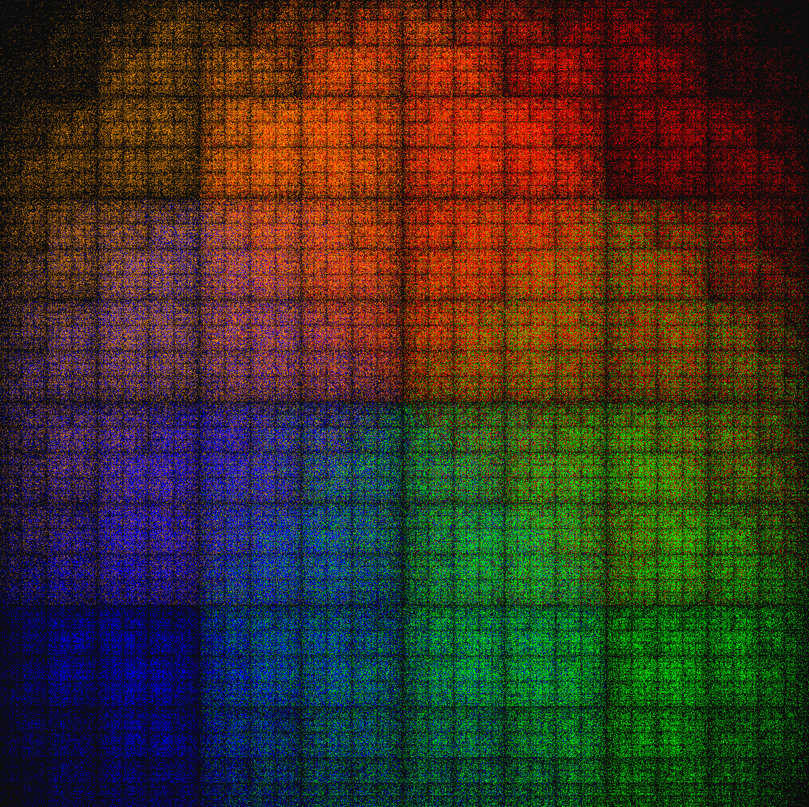

# Console Visualization of Genomic Sequences

  
  
  
  
  

# Description
Chaos game visualization of DNA sequencing that draws in console, with a more selective plotting technique. This is a purely speculative project for fun, and should be viewed as such.

## The K variable

  

By modifying the variable K, the program divides the sequence into substrings of length K and uses each base within the substring to more selectively decide where on the border of the square it should move halfway towards. See the diagram above for a visual explaination.

## Special Thanks
The inspiration and underlying knowledge is from the section on fractal DNA visualization from Professor Daniel Ashlock's book [Evolutionary Computation for Modeling and Optimization](https://www.springer.com/gp/book/9780387221960).
